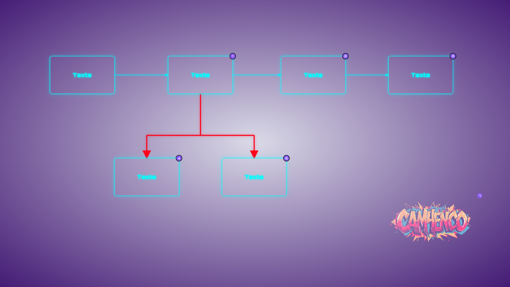
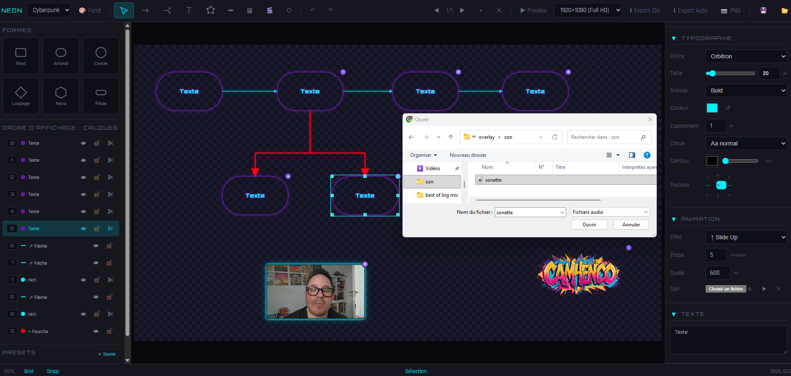
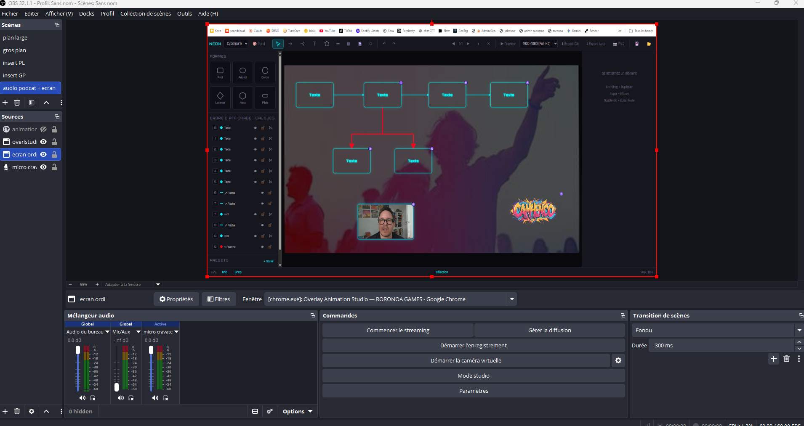
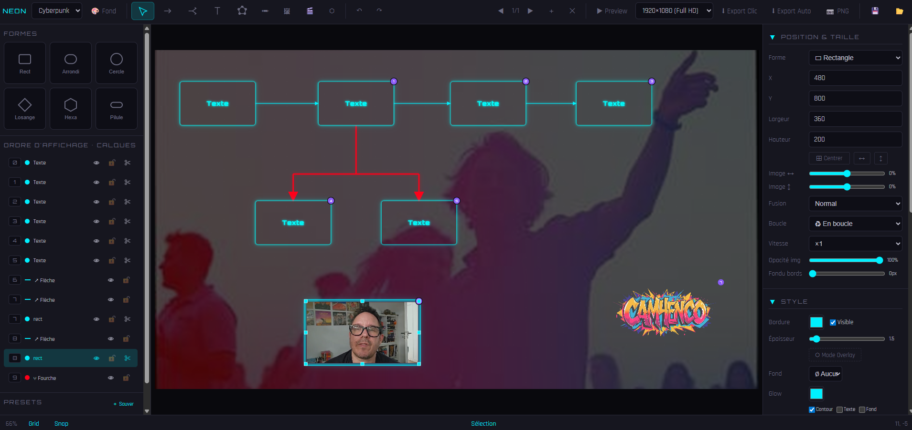

# ⬡ Overlay Animation Studio

### Éditeur neon d'overlays animés pour streams, vidéos et présentations

**[⬇️ Télécharger](https://github.com/cookhenri-art/OverlayAnimStudio/releases/latest)** &nbsp;·&nbsp;
**[🌐 Site officiel](https://roronoa-games.com/product-overlayanimstudio.html)** &nbsp;·&nbsp;
**[🐛 Signaler un bug](https://github.com/cookhenri-art/OverlayAnimStudio/issues)**

---

**三刀流 · Santōryū Style** — une création [RORONOA GAMES](https://roronoa-games.com)

---

## ✨ Aperçu

Overlay Animation Studio est un éditeur visuel complet pour créer des **habillages animés neon** destinés aux streamers (OBS), vidéastes (YouTube, TikTok), formateurs et créateurs de contenu. Le logiciel est :

- 🔒 **100 % offline** — aucune connexion réseau, aucun compte, aucun tracking
- 💾 **Standalone** — un seul fichier HTML portable ou un .exe Windows
- 🎨 **Complet** — formes, flèches, texte riche, médias, animations, multi-slides
- ⚡ **Export pro** — HTML autonome pour OBS Browser Source et export PNG, résolutions HD à 4K
- 🌿 **Freeware** — usage personnel ET commercial, monétisation libre

## 📸 Captures d'écran

| Éditeur principal | Effets neon & glow |
|:---:|:---:|
|  |  |

| Animations multi-slides | Export & intégration OBS |
|:---:|:---:|
|  |  |

## 🎯 Fonctionnalités

### Outils de dessin
- 7 formes : rectangles, arrondis, cercles, losanges, hexagones, pilules, formes libres à points
- Flèches simples et **fourches** (arrow forks) connectées aux formes
- **Mode dessin continu** pour tracer en temps réel
- Sélection multiple, alignement, distribution, centrage canvas

### Style & habillage
- **5 thèmes neon** : Cyberpunk, Minimal, Neon Pop, Ocean, Sunset
- Bordures, remplissages unis ou dégradés, effets glow configurables
- **Modes de fusion** : multiply, screen, overlay, difference, hue, etc. (15 modes)
- **Pulse animation** pour les éléments lumineux
- **Cutouts** et masques SVG par élément

### Typographie
- **10 polices embarquées** (offline) : Orbitron, Rajdhani, JetBrains Mono, Space Grotesk, Exo 2, Audiowide, Russo One, Chakra Petch, Share Tech Mono, Syne
- Éditeur de texte riche (gras, italique, couleurs, surlignage)
- Contour, espacement, casse, alignement 9 positions

### Médias
- Import **images** (JPG/PNG/WebP, ≤ 20 MB) avec opacité, offset, fondu de bords
- Import **vidéos** (MP4/WebM, ≤ 80 MB) avec boucle, vitesse 0.25× à 10×
- Import **audio** (MP3/WAV/OGG, ≤ 15 MB) synchronisé par étape d'animation
- **Bibliothèque d'icônes** SVG intégrée, coloration et glow personnalisables

### Animations
- **16 effets** : Slide, Scale, Glow Pulse, Bounce, Élastique, Rotation, Spirale, Flip H/V, Blur, Wipe, Zoom rebond
- **Multi-slides** avec transitions step-by-step ou autoplay
- Durée et étape par élément, sons synchronisés

### Export
- **Clic-par-clic** ou **autoplay OBS**
- Résolutions : 1280×720, 1920×1080, 2560×1440, 3840×2160, 1080×1920 portrait, 1080×1080 carré
- Formats : **HTML autonome** (fichier unique lisible dans OBS Browser Source ou tout navigateur, avec animations intégrées), **PNG** (fond transparent possible)
- Export / import des **presets** en JSON (formes, flèches, fonds favoris)

### Autres
- Undo/Redo (60 niveaux)
- Copier/Coller multi-slides (Ctrl+C / Ctrl+V)
- Raccourcis clavier (V, A, F, T, L, D, I)
- Mode Preview avant export

## 💾 Installation

### Windows (recommandé)

1. Télécharger **[OverlayAnimStudio-autonome.exe](https://github.com/cookhenri-art/OverlayAnimStudio/releases/latest)**
2. Double-cliquer pour installer
3. Lancer depuis le menu Démarrer

> **Note antivirus** : l'installeur NSIS peut être temporairement signalé par certains antivirus (faux positif connu du format NSIS). Vérifier le hash SHA-256 publié dans la release GitHub. Un contournement est d'utiliser la version HTML ci-dessous.

### Version HTML (Windows / macOS / Linux / ChromeOS)

1. Télécharger **[OverlayAnimStudio.html](https://github.com/cookhenri-art/OverlayAnimStudio/releases/latest)** (~870 Ko)
2. Double-cliquer — s'ouvre dans votre navigateur par défaut
3. Fonctionne hors ligne, tout est embarqué dans le fichier

Navigateurs supportés : Chrome, Edge, Firefox, Safari (versions 2023+).

## 🚀 Démarrage rapide

1. **Ouvrir** le logiciel
2. **Choisir un thème** dans la barre du haut (ex : Cyberpunk)
3. **Créer une forme** : cliquer sur un outil (rectangle, cercle…) puis dessiner sur le canvas
4. **Personnaliser** dans le panneau droit : couleur, glow, animation
5. **Ajouter des slides** avec le bouton `+`
6. **Prévisualiser** avec `▶ Preview` ou la touche `P`
7. **Exporter** en HTML autonome via `⬇ Export Auto` pour OBS Browser Source

### Raccourcis clavier

| Touche | Action |
|---|---|
| `V` | Outil Sélection |
| `A` | Outil Flèche |
| `F` | Outil Fourche |
| `T` | Outil Texte |
| `L` | Forme libre |
| `D` | Mode dessin continu |
| `I` | Insérer image |
| `P` | Preview |
| `Ctrl+Z` / `Ctrl+Shift+Z` | Undo / Redo |
| `Ctrl+C` / `Ctrl+V` | Copier / Coller |
| `Ctrl+A` | Tout sélectionner |
| `Delete` | Supprimer sélection |
| `F2` | Éditer texte riche |
| `Échap` | Fermer preview |
| `A` (en preview) | Autoplay |

## 🔒 Vie privée

Overlay Animation Studio respecte votre vie privée par conception :

- ❌ Aucun appel réseau sortant (`fetch`, `XMLHttpRequest`, `WebSocket` tous désactivés via CSP)
- ❌ Aucun cookie, `localStorage`, `sessionStorage`, ni `IndexedDB`
- ❌ Aucun tracker, aucune télémétrie, aucun analytics
- ❌ Aucun compte, aucune inscription
- ✅ Fonctionne à 100 % hors ligne, même après déconnexion complète
- ✅ Vos projets sont stockés uniquement en local (fichiers `.json`)

Conforme RGPD par absence de traitement. Voir [LICENSE](./LICENSE) et [AUDIT-REPORT.md](./AUDIT-REPORT.md).

## 🛡️ Sécurité

Le code est audité selon OWASP Top 10 et les standards 2025-2026. Les 12 patchs de sécurité appliqués couvrent :

- ✅ Politique CSP stricte (`connect-src 'none'`, `frame-src 'none'`, `object-src 'none'`)
- ✅ Sanitizer HTML custom avec whitelist, protection anti mutation XSS
- ✅ Anti Prototype Pollution (reviver `JSON.parse`)
- ✅ Validation de schéma JSON stricte + limites de taille par type de fichier
- ✅ Validation MIME + limites taille (image 20 MB, audio 15 MB, vidéo 80 MB, JSON 5 MB)
- ✅ Protection contre CVE-2025 sanitizer bypass (depth flatten, namespaces SVG/MathML)

Un [rapport d'audit complet](./AUDIT-REPORT.md) est disponible (score 97/100, passe Red Team incluse).

**Signaler une faille de sécurité** : créer une [issue privée](https://github.com/cookhenri-art/OverlayAnimStudio/security/advisories/new) plutôt qu'une issue publique.

## 📋 Spécifications techniques

| Propriété | Valeur |
|---|---|
| Version | 1.0.0 |
| Plateformes | Windows 10/11 (.exe), navigateurs modernes (.html) |
| Poids HTML | ≈ 870 Ko (avec 10 polices embarquées) |
| Poids EXE | ≈ 70 MB (installeur NSIS avec webview) |
| Dépendances | Aucune (tout est embarqué) |
| Formats export | HTML autonome, PNG, JSON (presets et projets) |
| Licence | Freeware (voir [LICENSE](./LICENSE)) |
| Langue UI | Français |

## 🤝 Contribuer

Ce projet est freeware mais pas open source au sens strict (voir [LICENSE](./LICENSE)). Vous êtes toutefois encouragé à :

- 🐛 **Signaler des bugs** via les [Issues](https://github.com/cookhenri-art/OverlayAnimStudio/issues)
- 💡 **Proposer des fonctionnalités** dans les Discussions
- 📚 **Partager vos créations** sur les réseaux sociaux avec le tag `#OverlayAnimStudio`
- 🌍 **Traduire l'interface** (contactez [RORONOA GAMES](https://roronoa-games.com) pour coordonner)

## 📦 Autres produits RORONOA GAMES

| Produit | Description |
|---|---|
| [Les Saboteurs](https://saboteurs.roronoa-games.com) | Jeu de déduction sociale multijoueur (6-12 joueurs) |
| [Chess Battle Camp](https://roronoa-games.itch.io/chess-battle-camp) | Stratégie tour par tour 3D sur grille hexagonale |
| [GeoTag](https://geotag.roronoa-games.com) | Réseau social géolocalisé PWA |
| [Singer Master](https://github.com/cookhenri-art/singer-master) | Jeu musical multijoueur 2-20 joueurs |
| [StemSampler Pro](https://github.com/cookhenri-art/stemsampler-pro) | Plugin VST3/CLAP — séparation de stems par IA |
| **AI Factory Studio** | Studio IA local tout-en-un (bientôt) |

→ [Catalogue complet sur roronoa-games.com](https://roronoa-games.com/products.html)

## 📜 Licence

Overlay Animation Studio est distribué sous une licence **Freeware** pour usage personnel et commercial. Les créations que vous produisez avec le logiciel vous appartiennent intégralement — y compris en cas d'usage commercial. Voir [LICENSE](./LICENSE) pour les conditions complètes.

© 2026 RORONOA GAMES. Tous droits réservés.

---

**[🏠 Site officiel](https://roronoa-games.com)** &nbsp;·&nbsp;
**[📱 @roronoa.games](https://www.instagram.com/roronoa_games/)** &nbsp;·&nbsp;
**[📘 Facebook](https://www.facebook.com/profile.php?id=61587474752031)** &nbsp;·&nbsp;
**[🎵 Camhenco sur Spotify](https://open.spotify.com/intl-fr/artist/04OndO5DLKuUWjNlw3NBN1)**

**三刀流 · Santōryū Style**

